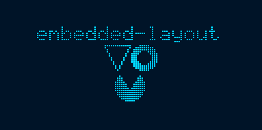

embedded-layout
===============

`embedded-layout` extends [`embedded-graphics`] with basic layout functions.

**Note:** This library is currently highly experimental. Expect API breakage with every update.

`embedded-layout` consists of two main parts:
 - alignments that can be used to position two objects relative to one another
 - layouts that can be used to arrange multiple views

## Example

The examples are based on [the embedded-graphics simulator](https://github.com/jamwaffles/embedded-graphics/tree/master/simulator). The simulator is built on top of `SDL2`. If you don't have that installed, set the `EG_SIMULATOR_DUMP="screenshot.png"` environment variable so that running the examples produce a screenshot image instead of a window.



```rust
use embedded_graphics_simulator::{
    BinaryColorTheme, OutputSettingsBuilder, SimulatorDisplay, Window,
};

use embedded_graphics::{
    fonts::{Font6x8, Text},
    pixelcolor::BinaryColor,
    primitives::{Circle, Triangle},
    style::{PrimitiveStyle, TextStyleBuilder},
};
use embedded_layout::{layout::linear::LinearLayout, layout::ViewGroup, prelude::*};

fn main() -> Result<(), core::convert::Infallible> {
    let mut display: SimulatorDisplay<BinaryColor> = SimulatorDisplay::new(Size::new(128, 64));

    let output_settings = OutputSettingsBuilder::new()
        .theme(BinaryColorTheme::OledBlue)
        .build();

    // Create a Rectangle from the display's dimensions
    let display_area = display.display_area();

    // Style objects
    let text_style = TextStyleBuilder::new(Font6x8)
        .text_color(BinaryColor::On)
        .build();

    let thin_stroke = PrimitiveStyle::with_stroke(BinaryColor::On, 1);
    let thick_stroke = PrimitiveStyle::with_stroke(BinaryColor::On, 3);
    let fill_on = PrimitiveStyle::with_fill(BinaryColor::On);
    let fill_off = PrimitiveStyle::with_fill(BinaryColor::Off);

    // Primitives to be displayed
    let triangle = Triangle::new(Point::new(0, 0), Point::new(12, 0), Point::new(6, 12))
        .into_styled(thin_stroke);

    let circle = Circle::new(Point::zero(), 6).into_styled(thick_stroke);
    let circle2 = Circle::new(Point::zero(), 7).into_styled(fill_on);
    let triangle2 =
        Triangle::new(Point::new(0, 0), Point::new(10, 0), Point::new(5, 8)).into_styled(fill_off);
    let text = Text::new("embedded-layout", Point::zero()).into_styled(text_style);

    // The layout
    LinearLayout::vertical()
        .with_alignment(horizontal::Center)
        .add_view(text)
        .add_view(
            LinearLayout::horizontal()
                .add_view(triangle)
                .add_view(circle)
                .arrange(),
        )
        .add_view(
            ViewGroup::new()
                .add_view(triangle2.align_to(&circle2, horizontal::Center, vertical::Top))
                .add_view(circle2),
        )
        .arrange()
        .align_to(&display_area, horizontal::Center, vertical::Center)
        .draw(&mut display)
        .unwrap();

    Window::new("Layout example", &output_settings).show_static(&display);
    Ok(())
}
```

[`embedded-graphics`]: https://github.com/jamwaffles/embedded-graphics/
